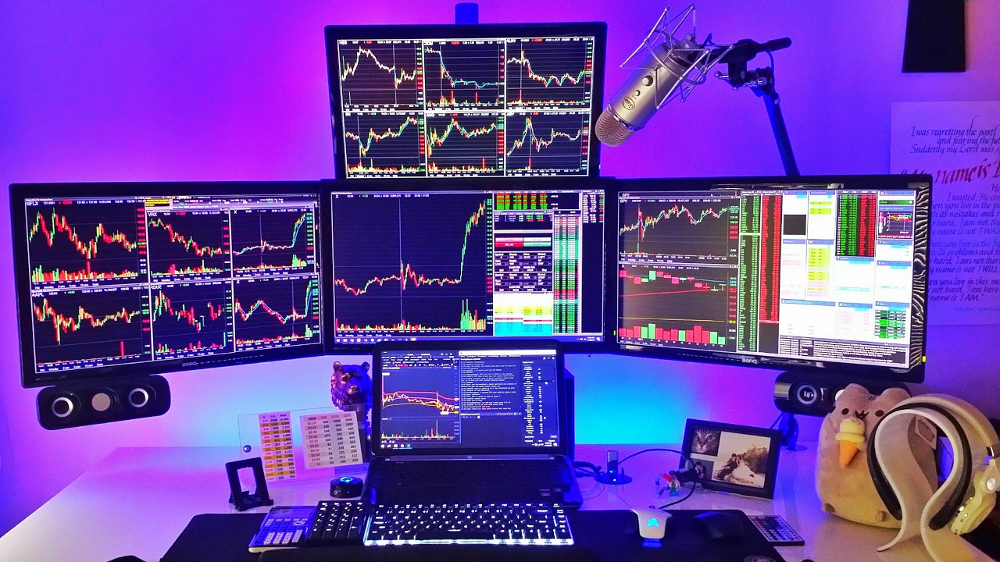

```{r, echo=FALSE, warning=FALSE, message=FALSE}
library("here")
library("kableExtra")
library("keras")
library("ggpubr")
library("plot.matrix")
library("reticulate")
library("readr")
library("tfruns")
library("tibbletime")
library("tidyquant")
library("tidyverse")
```


## Introduction

- We trade cryptocurrencies, but we are unsuccessful so far 
- Can we create a deep learning model that can make decisions for us? 


## Approach

- Most studies focus on a numeric approach
- We chose an alternative way for the prediction
- Traders usually make decisions by looking at graphs

## A trader 

<center><div style="width:600px; height:400px"></div></center>


## Objectives

- Can a convolutional neural network predict a future price direction by reading charts?
- We decided to take two approaches to find the best way


## Initial dataset 

```{r,  echo=FALSE, warning=FALSE, message=FALSE}
# Import the dataset 

load(here::here("data/btc.Rdata"))

# Convert the time format 
btc$Timestamp <- as.POSIXct(btc$Timestamp, origin="1970-01-01") %>% na.omit()


for(i in 2:ncol(btc)){
  btc[is.nan(btc[,i][[1]]),i] <- NA
}

# Rename columns and remove missing values

btc <- btc %>% 
  dplyr::rename(time = Timestamp, volume_btc = `Volume_(BTC)`,volume_usd = `Volume_(Currency)`) %>% 
  drop_na()

# Remove capital letters

colnames(btc) <- tolower(colnames(btc))

#transform to hourly data instead of daily

btc_hourly <- btc %>%
  as_tbl_time(time) %>%
  mutate(time = collapse_index(time, "hourly")) %>%
  group_by(time) %>%
  summarise(
    open   = first(open),
    high   = max(high),
    low    = min(low),
    close  = last(close),
    volume_usd = sum(volume_usd))

btc_hourly$time <- as.POSIXct(droplevels(cut(btc_hourly$time, breaks="hour")))


```


```{r,  echo=FALSE, warning=FALSE, message=FALSE}

# Create a table to present the dataset
kable(head(btc_hourly)) %>%
  kable_styling()

```

## Transformation

- We generated indicators such as moving average and oscillators
- We plotted these indicators

## First approach


```{r, echo=FALSE, warning=FALSE, message=FALSE}

#set indicators

fib <- c(5,8,13,21,34,55,144)
  
for(i in fib){
  btc_hourly <- btc_hourly %>%
  tq_mutate(select  = close, mutate_fun = EMA ,n=i ,col_rename = paste0("EMA.",i)) 
}

for(i in fib){
  btc_hourly <- btc_hourly %>%
  tq_mutate(select  =  close, mutate_fun = SMA,n=i ,col_rename = paste0("SMA.",i)) 
}


for(i in fib){
 btc_hourly <- btc_hourly %>%
  tq_mutate(select  = close, mutate_fun = RSI, n = i ,col_rename = paste0("RSI.",i))
}

for(i in fib){
  btc_hourly <- btc_hourly %>%
  tq_mutate(select  = close, mutate_fun = VWAP ,n=i, volume = btc_hourly$volume_usd ,col_rename = paste0("VWAP.",i))
}

for(i in fib){
  btc_hourly <- btc_hourly %>%
  tq_mutate(select  = close, mutate_fun = MACD ,
            nFast = i,
            nSlow = i+14,
            nSig = i-3,
            col_rename = paste0("MACD.",i))
}

for(i in c(1,fib[-length(fib)])){
  btc_hourly <- btc_hourly %>%
  tq_mutate(select  = close, mutate_fun = momentum ,n=i,col_rename = paste0("momentum.",i))
}


for(i in fib){
  btc_hourly <- btc_hourly %>%
  tq_mutate(mutate_fun = ADX ,n=i ,col_rename = paste0("ADX.",i))
}

for(i in fib){
  btc_hourly <- btc_hourly %>%
  tq_mutate(select  = close,mutate_fun = SMI ,n=i ,col_rename = paste0("SMI.",i))
}


for(i in fib){
  btc_hourly <- btc_hourly %>%
  tq_mutate(select  = close,mutate_fun = ALMA ,n=i ,col_rename = paste0("SMI.",i))
}


btc_hourly <- btc_hourly %>%
  tq_mutate(mutate_fun = williamsAD ,col_rename = paste0("williamsAD"))


btc_hourly <- btc_hourly %>% na.omit()


```

```{r, echo=FALSE, warning=FALSE, message=FALSE}


btc_hourly$log_returns <- c(0,diff(log(btc_hourly$close), lag=1))

##take derivative
btc_hourly$log_returns_EMA_13 <- c(0,diff(log(btc_hourly$EMA.13), lag=1))
btc_hourly$log_returns_EMA_55 <- c(0,diff(log(btc_hourly$EMA.55), lag=1))
btc_hourly$log_returns_EMA_144 <- c(0,diff(log(btc_hourly$EMA.144), lag=1))


btc_hourly <- btc_hourly %>% na.omit()

```

```{r, echo=FALSE, warning=FALSE, message=FALSE, fig.align='center', out.width="100%"}

ret <- btc_hourly$log_returns[(i*24):(i*24+168)]
  ret <- cumsum(ret)

  ret_long <- btc_hourly$log_returns_EMA_13[round(seq(ifelse(i*24<2160,1,i*24-2159), (i*24+168), length.out = 169))]
  ret_long <- cumsum(ret_long)
  
  EMA144 <- btc_hourly$log_returns_EMA_144[(i*24):(i*24+168)]
  EMA144 <- cumsum(EMA144)
  
  EMA55 <- btc_hourly$log_returns_EMA_55[(i*24):(i*24+168)]
  EMA55 <- cumsum(EMA55)
  
  EMA13 <- btc_hourly$log_returns_EMA_13[(i*24):(i*24+168)]
  EMA13 <- cumsum(EMA13)
  
  RSI13 <- btc_hourly$RSI.13[(i*24):(i*24+168)]/100

  
# Peut être faire un graph a 4 petits graphs? 
 a <- ggplot()+
    geom_line(aes(1:length(ret),y = EMA144), color = "green",size=5, alpha =0.8) +
    xlim(0, 168)+
    ylim(-max(abs(EMA144)), max(abs(EMA144)))+
    theme_void()


b <- ggplot()+
    geom_line(aes(1:length(ret),y = EMA55), color = "blue",size=5, alpha =0.8) +
    xlim(0, 168)+
    ylim(-max(abs(EMA55)), max(abs(EMA55)))+
    theme_void()

c <- ggplot()+
    geom_line(aes(1:length(ret),y = EMA13), color = "red",size=5, alpha =0.7) +
    xlim(0, 168)+
    ylim(-max(abs(EMA13)), max(abs(EMA13)))+
    theme_void()

d <- ggplot()+
    geom_line(aes(1:length(ret),y = ret_long),color = "yellow",size=5, alpha =0.7)+
    xlim(0, 168)+
    ylim(-max(abs(ret_long)), max(abs(ret_long)))+
    theme_void()

e <- ggplot()+
    geom_line(aes(1:length(ret),y = ret),size=5)+
    xlim(0, 168)+
    ylim(-max(abs(ret)), max(abs(ret)))+
    theme_void()

f <- ggplot()+
    geom_line(aes(1:length(ret),y = RSI13),color = "brown",size=5)+
    xlim(0, 168)+
    ylim(-max(abs(RSI13)), max(abs(RSI13)))+
    theme_void()

ggarrange(a,b,c,d,e,f)


```

## Generated data
- 2800 images in this format were generated
- They were classified into three different folders
- First category: buy, if during the next 12 hours the price increase by more than 2%
- Second category: sell, if during the next 12 hours the price decrease by more than  2%
- Third category: hold, takes all the remaining images. 

## Model 1

- Six convolutional layers and two dense layers
- Tuning parameters: dropout, number of filters, and regularisers (L1 and L2)
- Dynamic learning rate and early stopping

## Results

```{r,echo=FALSE, warning=FALSE}

load(here("report/saved_table/results_graph.rda"))

results %>% kable() %>% 
  kable_styling()
```

## Second approach

- The second approach was inspired by existing papers, and we decided to plot a grid representing different prices and indicators information

```{r, echo=FALSE, warning=FALSE, message=FALSE, fig.align='center'}

norm_fun <- function(x){
  norm_x <- (x-min(x))/(max(x)-min(x))
  return(norm_x)
}

log_returns <- btc_hourly$log_returns
btc_hourly <- btc_hourly[,!grepl("log", colnames(btc_hourly))]

for(i in 2:ncol(btc_hourly)){
  btc_hourly[,i] <- norm_fun(btc_hourly[,i])
}


data_all <- NULL
train_y <- NULL
test_y <- NULL

for (i in 22:(nrow(btc_hourly)/12)) {
  
  
  data <- btc_hourly[i*12, 2:ncol(btc_hourly)] %>%
    unlist(use.names = FALSE)
  
  data <- c(btc_hourly$EMA.5[(i*12-(224-length(data))):(i*12)], data)
  
  if(length(data)!= 225){
    break
  }
  
  data_all <- c(data_all, data)
  
  if(i <= (nrow(btc_hourly)/12)*0.8){
  if (sum(log_returns[(i*12-12):(i*12)]) >= 0.02) {
    train_y <- c(train_y, "buy")
  } else if (sum(log_returns[(i*12-12):(i*12)]) <= -0.02) {
    train_y <- c(train_y, "sell")
  } else{
    train_y <- c(train_y, "hold")
  }}else{
    if (sum(log_returns[(i*12-12):(i*12)]) >= 0.02) {
    test_y <- c(test_y, "buy")
  } else if (sum(log_returns[(i*12-12):(i*12)]) <= -0.02) {
    test_y <- c(test_y, "sell")
  } else{
    test_y <- c(test_y, "hold")
  }
}
}


train_x <- array_reshape(data_all[1:(length(train_y)*225)], dim = c(length(train_y),15,15,1))

test_x <- array_reshape(data_all[1:(length(test_y)*225)], dim = c(length(test_y),15,15,1))

train_y <- ifelse(train_y=="buy",0,ifelse(train_y =="sell",1,2))
test_y <- ifelse(test_y=="buy",0,ifelse(test_y =="sell",1,2))

plot(train_x[588,,,])

```

## Model 2

- Two convolutional layers and two dense layers
- Tuning parameters: dropout, number of filters, and regularisers (L1 and L2)
- Dynamic learning rate and early stopping


## Results

```{r,echo=FALSE, warning=FALSE}
load(here("report/saved_table/results_grid.rda"))
results <- tibble(loss = results$loss,
       accuracy = results$accuracy)
results %>% 
  kable() %>% 
  kable_styling()
```

## Conclusion
- Disappointing results, we will not become rich easily
- For the first model, we believe that image resolution was too low
- Wrong model construction
- Not enough free data